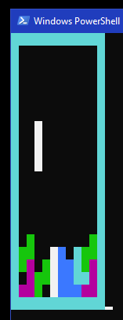

# particleTetris - PowerShell Edition

This is meant to be the repo for a PowerShell implementation of Tetris which will treat each termino as a set of 4x particles with different layers of the fabric of "spacetime" that interact and change as the arrow of time marches forward

## How to run

- Download Repository
- Navigate to the proj folder on the PowerShell cli
- ```powershell
Import-Module .\init.ps1
Play-Tetris
```
- Note, there is NO progression of time, and there are bugs on the line clear function
- Enjoy!

## Screen Shot Example



